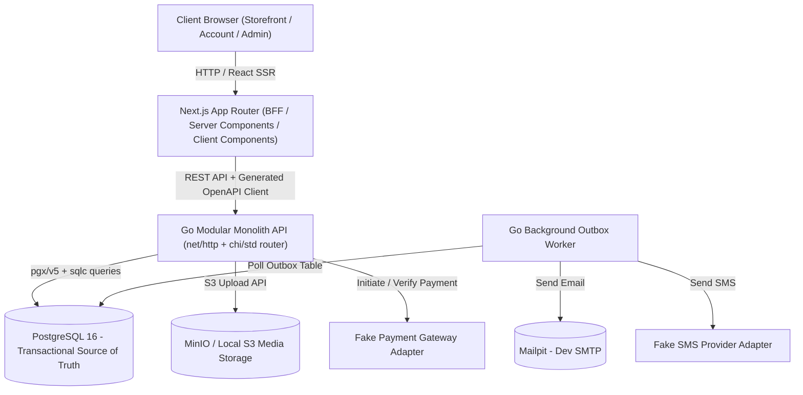

# System Architecture Specification - MoringaLab Commerce (`فروشگاه سبزینه`)

## 1. High-Level Architecture Overview

MoringaLab Commerce is constructed as a **Modular Monolith** in Go for the Backend API & Worker, coupled with a **Next.js 15 App Router** application acting as the Storefront & Admin Panel frontend (BFF layer).



---

## 2. Go Modular Monolith Structure (`apps/api`)

The backend codebase is divided strictly into domain modules under `internal/`. Direct database calls cross-module are prohibited; modules interact via internal Go service interfaces or domain events.

```text
apps/api/internal/
├── platform/             # Infrastructure & Shared Platform Concerns
│   ├── config/           # Environment variable validation & parsing
│   ├── database/         # PostgreSQL connection pool setup (pgxpool)
│   ├── httpserver/       # HTTP server lifecycle, graceful shutdown
│   ├── middleware/       # Recovery, CORS, Rate Limit, Auth Context, Request ID
│   ├── observability/    # Structured slog logging & metrics
│   ├── storage/          # S3/MinIO media storage provider adapter
│   └── clock/            # Time abstraction for deterministic testing
├── identity/             # Customer OTP auth, Admin password auth, Session & Cookie tokens
├── customers/            # Customer profile management, Saved shipping addresses
├── catalog/              # Products, Variants, Categories, Brands, Media attachments, Attributes
├── pricing/              # Pricing calculation engine, Price breakdown, Currency conversion
├── inventory/            # Warehouse stock ledger, Concurrency-safe reservations, Movement logs
├── carts/                # Guest/User cart, Guest-to-user cart merge logic
├── promotions/           # Coupon validation, Fixed/Percentage discounts, Redemption limits
├── checkout/             # Order quote generation, Checkout transactional orchestrator
├── orders/               # Order snapshot generation, Order state machine, Order timeline
├── payments/             # Payment attempt lifecycle, Callback verification, Webhook processing
├── shipping/             # Shipping zone calculations, Shipping tracking events
├── returns/              # Customer return request processing & store credit/refund linkage
├── content/              # Blog articles, Scientific review workflow, Health disclaimers, FAQs
├── reviews/              # Product reviews (verified purchase enforce), Q&A moderation
├── wishlists/            # Customer wishlist management
├── notifications/        # Outbox event publisher, SMS & Email notification templates
├── settings/             # Store settings, Business variables, Branding configuration
├── reporting/            # Sales reporting, Analytics queries
└── audit/                # Audit log recorder for administrative actions
```

---

## 3. Frontend Architecture (`apps/web`)

The Next.js 15 App Router is organized into distinct route groups for isolation and security:

```text
apps/web/app/
├── (storefront)/         # Public Storefront pages (Home, Catalog, Product, Blog, Cart, Checkout)
├── (account)/            # Customer Account Portal (Orders, Addresses, Wishlist, Security)
├── admin/                # Admin Operations Panel (High-density dashboards & management tables)
└── api/                  # BFF routes for Session cookie handling and API proxying
```

### OpenAPI Contract & Client Generation:
- Single source of truth API spec: `api-contract/openapi.yaml`.
- OpenAPI generator builds TypeScript API client in `apps/web/lib/api-client/`.
- Backend handlers and TypeScript client stay perfectly synced via CI check target (`make openapi-generate`).

---

## 4. Key Domain Invariants & Rules

1. **Transactional Inventory Ledger**: Available stock is computed as `available = on_hand - reserved`. Reservations are made inside PostgreSQL transactions with row locks (`SELECT ... FOR UPDATE`).
2. **Snapshot-Based Orders**: Once an order is created, item titles, prices, descriptions, and address details are copied into immutable snapshot tables (`order_items`, `order_addresses`).
3. **Idempotency**: All mutation endpoints (Checkout submission, Payment verification, Webhooks) require or produce idempotency keys to prevent duplicate actions.
4. **Audit Logging**: Every mutation performed by admin users creates an immutable entry in `audit_logs`.
