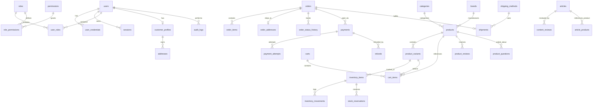

# Data Model & Database ERD Specification - MoringaLab Commerce (`فروشگاه سبزینه`)

## 1. Database Conventions & Standards

- **Engine**: PostgreSQL 16+.
- **Naming**: `snake_case` for all table names, column names, constraints, and indices.
- **Primary Keys**: UUID (`gen_random_uuid()`) for internal primary keys.
- **Human IDs**: Separate unique human-readable order numbers (e.g. `ML-1405-000123`).
- **Timestamps**: `timestamptz` for all date/time fields, stored strictly in UTC.
- **Currency**: `bigint` storing exact Iranian Rial (IRR) values. Floating point currency is strictly forbidden.
- **Weights & Quantities**: `integer` for weights in grams and quantities in units.
- **Concurrency**: Optimistic locking `version integer DEFAULT 1 NOT NULL` on critical mutable tables (`products`, `product_variants`, `inventory_items`).

---

## 2. Mermaid Entity Relationship Diagram (ERD)

---

## 3. Table Schema Definitions (45+ Tables)

### 3.1 Identity & RBAC Tables

#### `users`
- `id` UUID PRIMARY KEY DEFAULT gen_random_uuid()
- `phone` VARCHAR(20) UNIQUE NOT NULL -- Normalized Iranian mobile (e.g. +989123456789)
- `email` VARCHAR(255) UNIQUE -- Case-insensitive lowercased
- `first_name` VARCHAR(100)
- `last_name` VARCHAR(100)
- `is_active` BOOLEAN NOT NULL DEFAULT true
- `created_at` TIMESTAMPTZ NOT NULL DEFAULT NOW()
- `updated_at` TIMESTAMPTZ NOT NULL DEFAULT NOW()

#### `user_credentials`
- `user_id` UUID PRIMARY KEY REFERENCES users(id) ON DELETE CASCADE
- `password_hash` VARCHAR(255) -- Argon2id / Bcrypt hash
- `totp_secret` VARCHAR(255)
- `totp_enabled` BOOLEAN NOT NULL DEFAULT false
- `failed_login_attempts` INT NOT NULL DEFAULT 0
- `locked_until` TIMESTAMPTZ

#### `otp_challenges`
- `id` UUID PRIMARY KEY DEFAULT gen_random_uuid()
- `phone` VARCHAR(20) NOT NULL
- `otp_hash` VARCHAR(255) NOT NULL -- SHA256 hashed OTP code
- `attempts` INT NOT NULL DEFAULT 0
- `max_attempts` INT NOT NULL DEFAULT 3
- `expires_at` TIMESTAMPTZ NOT NULL
- `consumed_at` TIMESTAMPTZ
- `created_at` TIMESTAMPTZ NOT NULL DEFAULT NOW()

#### `sessions`
- `id` UUID PRIMARY KEY DEFAULT gen_random_uuid()
- `user_id` UUID NOT NULL REFERENCES users(id) ON DELETE CASCADE
- `token_hash` VARCHAR(255) UNIQUE NOT NULL
- `ip_address` VARCHAR(45)
- `user_agent` TEXT
- `expires_at` TIMESTAMPTZ NOT NULL
- `created_at` TIMESTAMPTZ NOT NULL DEFAULT NOW()

#### `roles`, `permissions`, `user_roles`, `role_permissions`
- Standard RBAC table structures mapping granular permission strings (e.g., `product.read`, `inventory.adjust`, `order.status.update`).

---

### 3.2 Customer & Address Tables

#### `customer_profiles`
- `id` UUID PRIMARY KEY DEFAULT gen_random_uuid()
- `user_id` UUID UNIQUE NOT NULL REFERENCES users(id) ON DELETE CASCADE
- `national_id` VARCHAR(10)
- `birth_date` DATE
- `created_at` TIMESTAMPTZ NOT NULL DEFAULT NOW()

#### `addresses`
- `id` UUID PRIMARY KEY DEFAULT gen_random_uuid()
- `customer_id` UUID NOT NULL REFERENCES customer_profiles(id) ON DELETE CASCADE
- `title` VARCHAR(100) NOT NULL
- `recipient_name` VARCHAR(150) NOT NULL
- `recipient_phone` VARCHAR(20) NOT NULL
- `province` VARCHAR(100) NOT NULL
- `city` VARCHAR(100) NOT NULL
- `postal_address` TEXT NOT NULL
- `postal_code` VARCHAR(10) NOT NULL
- `is_default` BOOLEAN NOT NULL DEFAULT false
- `created_at` TIMESTAMPTZ NOT NULL DEFAULT NOW()

---

### 3.3 Catalog & Media Tables

#### `brands`
- `id` UUID PRIMARY KEY DEFAULT gen_random_uuid()
- `name_fa` VARCHAR(150) NOT NULL
- `slug` VARCHAR(150) UNIQUE NOT NULL

#### `categories`
- `id` UUID PRIMARY KEY DEFAULT gen_random_uuid()
- `parent_id` UUID REFERENCES categories(id) ON DELETE SET NULL
- `name_fa` VARCHAR(150) NOT NULL
- `slug` VARCHAR(150) UNIQUE NOT NULL
- `description_fa` TEXT
- `sort_order` INT NOT NULL DEFAULT 0

#### `products`
- `id` UUID PRIMARY KEY DEFAULT gen_random_uuid()
- `brand_id` UUID REFERENCES brands(id) ON DELETE SET NULL
- `slug` VARCHAR(200) UNIQUE NOT NULL
- `title_fa` VARCHAR(250) NOT NULL
- `short_description_fa` TEXT
- `full_description_fa` TEXT
- `product_type` VARCHAR(20) NOT NULL CHECK (product_type IN ('simple', 'variable'))
- `status` VARCHAR(20) NOT NULL CHECK (status IN ('draft', 'in_review', 'published', 'unpublished', 'archived'))
- `is_featured` BOOLEAN NOT NULL DEFAULT false
- `usage_instructions_fa` TEXT
- `ingredients_fa` TEXT
- `warnings_fa` TEXT
- `storage_conditions_fa` TEXT
- `country_of_origin` VARCHAR(100)
- `license_number` VARCHAR(100)
- `seo_title` VARCHAR(250)
- `seo_description` TEXT
- `version` INT NOT NULL DEFAULT 1
- `published_at` TIMESTAMPTZ
- `created_at` TIMESTAMPTZ NOT NULL DEFAULT NOW()
- `updated_at` TIMESTAMPTZ NOT NULL DEFAULT NOW()

#### `product_variants`
- `id` UUID PRIMARY KEY DEFAULT gen_random_uuid()
- `product_id` UUID NOT NULL REFERENCES products(id) ON DELETE CASCADE
- `sku` VARCHAR(100) UNIQUE NOT NULL
- `barcode` VARCHAR(100)
- `title_fa` VARCHAR(200) NOT NULL
- `price_irr` BIGINT NOT NULL CHECK (price_irr >= 0)
- `compare_at_price_irr` BIGINT CHECK (compare_at_price_irr IS NULL OR compare_at_price_irr > price_irr)
- `cost_price_irr` BIGINT CHECK (cost_price_irr >= 0)
- `net_weight_grams` INT NOT NULL CHECK (net_weight_grams >= 0)
- `shipping_weight_grams` INT NOT NULL CHECK (shipping_weight_grams >= 0)
- `is_active` BOOLEAN NOT NULL DEFAULT true
- `version` INT NOT NULL DEFAULT 1
- `created_at` TIMESTAMPTZ NOT NULL DEFAULT NOW()

---

### 3.4 Inventory Tables (Ledger-based)

#### `inventory_locations`
- `id` UUID PRIMARY KEY DEFAULT gen_random_uuid()
- `name` VARCHAR(100) NOT NULL

#### `inventory_items`
- `id` UUID PRIMARY KEY DEFAULT gen_random_uuid()
- `location_id` UUID NOT NULL REFERENCES inventory_locations(id)
- `variant_id` UUID NOT NULL REFERENCES product_variants(id) ON DELETE CASCADE
- `on_hand` INT NOT NULL DEFAULT 0 CHECK (on_hand >= 0)
- `reserved` INT NOT NULL DEFAULT 0 CHECK (reserved >= 0 AND reserved <= on_hand)
- `reorder_point` INT NOT NULL DEFAULT 5
- `version` INT NOT NULL DEFAULT 1
- UNIQUE(location_id, variant_id)

#### `inventory_movements`
- `id` UUID PRIMARY KEY DEFAULT gen_random_uuid()
- `inventory_item_id` UUID NOT NULL REFERENCES inventory_items(id)
- `movement_type` VARCHAR(30) NOT NULL CHECK (movement_type IN ('receive', 'sale', 'adjustment', 'return_restock', 'scrap'))
- `quantity_delta` INT NOT NULL
- `reason` TEXT NOT NULL
- `actor_id` UUID REFERENCES users(id)
- `created_at` TIMESTAMPTZ NOT NULL DEFAULT NOW()

#### `stock_reservations`
- `id` UUID PRIMARY KEY DEFAULT gen_random_uuid()
- `inventory_item_id` UUID NOT NULL REFERENCES inventory_items(id)
- `cart_id` UUID
- `order_id` UUID
- `quantity` INT NOT NULL CHECK (quantity > 0)
- `expires_at` TIMESTAMPTZ NOT NULL
- `released_at` TIMESTAMPTZ
- `created_at` TIMESTAMPTZ NOT NULL DEFAULT NOW()

---

### 3.5 Cart, Orders & Checkout Tables

#### `carts` & `cart_items`
- Cart and items storing customer selection with quantity constraints.

#### `orders`
- `id` UUID PRIMARY KEY DEFAULT gen_random_uuid()
- `order_number` VARCHAR(50) UNIQUE NOT NULL -- Human-readable (e.g. ML-1405-000123)
- `customer_id` UUID REFERENCES users(id)
- `guest_phone` VARCHAR(20)
- `status` VARCHAR(30) NOT NULL CHECK (status IN ('pending_payment', 'paid', 'processing', 'packed', 'shipped', 'delivered', 'cancelled', 'refund_requested', 'partially_refunded', 'refunded'))
- `subtotal_irr` BIGINT NOT NULL
- `discount_irr` BIGINT NOT NULL DEFAULT 0
- `shipping_fee_irr` BIGINT NOT NULL DEFAULT 0
- `total_irr` BIGINT NOT NULL
- `idempotency_key` VARCHAR(255) UNIQUE
- `created_at` TIMESTAMPTZ NOT NULL DEFAULT NOW()

#### `order_items` (Snapshot)
- Immutable item snapshot (`product_title`, `variant_title`, `sku`, `unit_price_irr`, `quantity`, `subtotal_irr`).

#### `order_addresses` (Snapshot)
- Immutable shipping address snapshot created at purchase time.

---

### 3.6 Payments & Audit Tables

#### `payments`, `payment_attempts`, `payment_events`, `refunds`
- Payment state machine tables tracking provider callback reference numbers, verification responses, and refund reasons.

#### `audit_logs`
- `id` UUID PRIMARY KEY DEFAULT gen_random_uuid()
- `actor_id` UUID NOT NULL REFERENCES users(id)
- `action` VARCHAR(100) NOT NULL
- `entity_type` VARCHAR(100) NOT NULL
- `entity_id` VARCHAR(255) NOT NULL
- `changes` JSONB NOT NULL
- `reason` TEXT
- `ip_address` VARCHAR(45)
- `created_at` TIMESTAMPTZ NOT NULL DEFAULT NOW()
